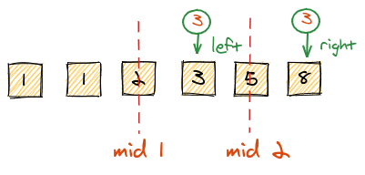
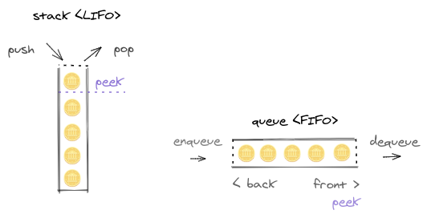
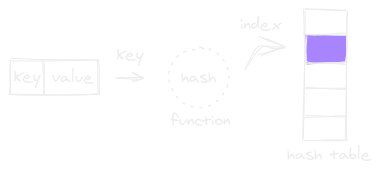
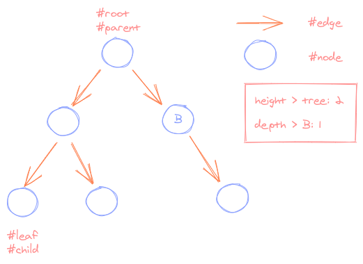

# 🗃️

1. map and set

- map

  - hash like
    - value value pair
  - object key
    - follow reference

- set
  - unique values
    - `===` except `NaN`
  - key equals value
  - iterable

```javascript
// union
new Set([...m, ...n])
// intersect
new Set([...m].filter((item) => n.has(item)))
// difference
new Set([...m].filter((item) => !n.has(item)))
```

`entries` return tuples

2. binary search



- `required` sorted sequence
- `time complexity` O(logn)

```javascript
let l = 0,
  r = s.length
while (l <= r) {
  const mid = (l + r) >>> 1 // l + ((r - l) >> 1)
  if (s[mid] === target) return mid
  else if (s[mid] > target) r = mid - 1
  else l = mid + 1
}
```

| operator | name                         | explanation                                   |
| -------- | ---------------------------- | --------------------------------------------- |
| <<       | left shift                   | 0 bits are added to the right                 |
| >>       | sign-propagating right shift | the copies of the leftmost bit are shifted in |
| >>>      | zero-fill right shift        | fill 0 bits to the left                       |

3. linked list

> a linked list is a linear collection of data elements whose order is not given by their physical placement in memory


- pros
  - easy to remove or add node without reorganize entire data structure
  - no waste of memory
- cons
  - search operation is slow
  - use more memory than array
- type
  - singly | doubly | circular

4. stack and queue

> collection of entities with several operations



|       | in      | out   |
| ----- | ------- | ----- |
| stack | push    | pop   |
|       | unshift | shift |
| queue | push    | shift |
|       | unshift | pop   |

5. hash table



- unsorted
- chaining

6. tree



- terminology

  - root
  - edge
  - leaf
  - parent
  - child
  - height
  - depth

- traverse
  - `dfs` as far as possible along each branch before backtracking
    - types pre-order | in-order | post-order
  - `bfs` neighbor nodes first before moving to next level
